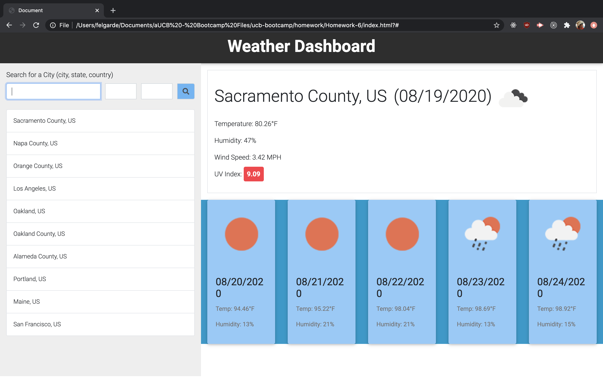

This repository is a week 5 homework submission for UCB Bootcamp

The homework task is to create a weather application using javscript. It will search for a city using the openweather API and will display information such as temperature, humidity, UV index and will also display a forecast for the next 5 days. History when clicked will search for the same city once again and when the page is refreshed last history will be displayed.

Below are screenshots of the homework from the project

This link goes to the live version of the homework.

[Live homework](https://berjonbatistiana.github.io/Homework-6/)

